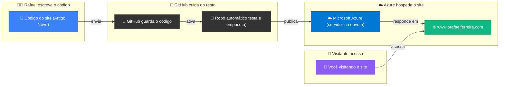
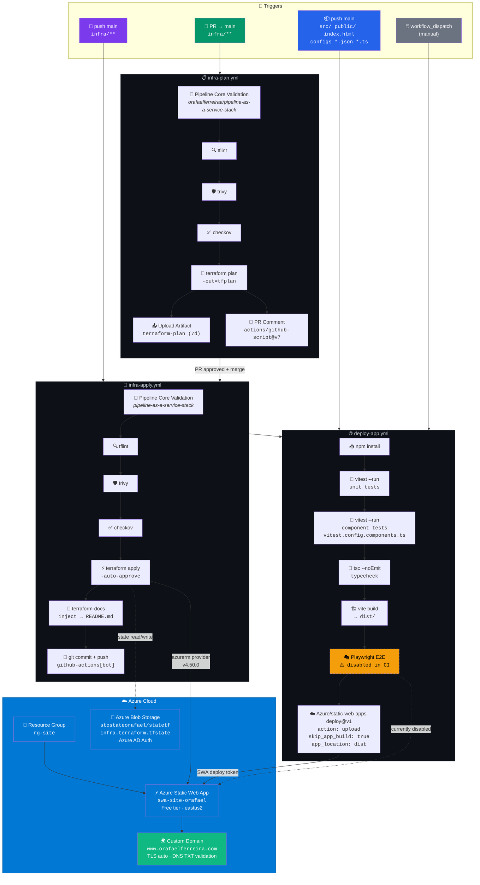
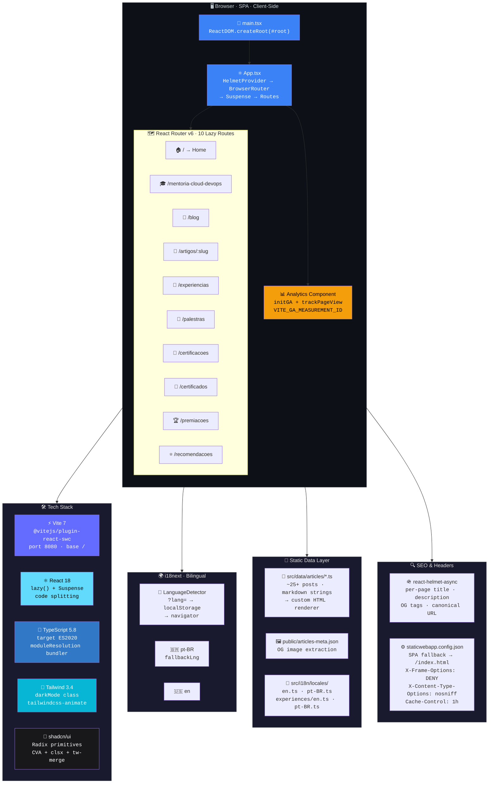
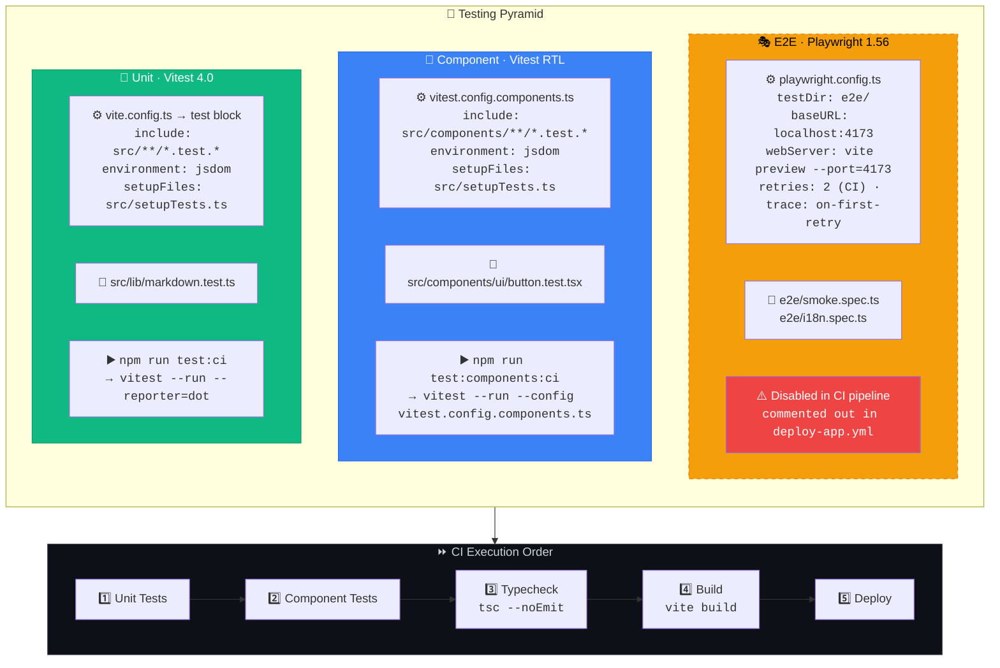
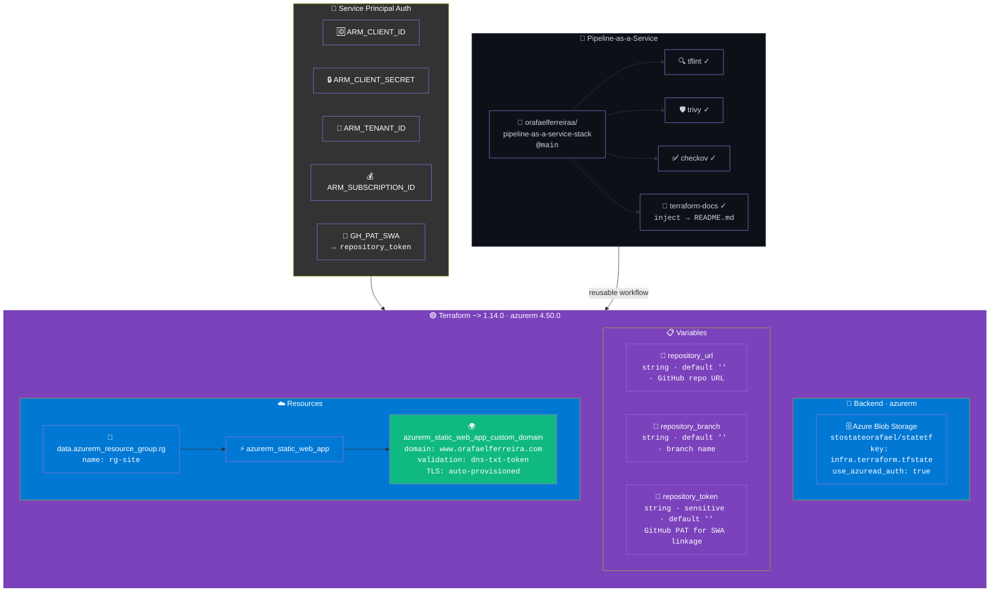

# orafaelferreira-com (SPA)

Site pessoal/Blog em Vite + React + TypeScript, hospedado na Azure Static Web Apps (SWA) com CI/CD via GitHub Actions e infraestrutura em Terraform.

## stack

- Vite, React, TypeScript, TailwindCSS, shadcn/ui
- Azure Static Web Apps (SWA) para hosting
- Terraform (infra/) com state remoto em Azure Storage
- GitHub Actions: deploy do app e provisionamento da infra

## desenvolvimento local

Requisitos: Node.js 20+

```bash
sudo apt update
sudo apt install npm
```

```bash
npm install
npm run dev
```

Build de produção:

```bash
npm run build
npm run preview
```

## Geração de sitemap e metadados

O site gera automaticamente `public/sitemap.xml` e `public/articles-meta.json` baseado nos arquivos reais de artigos em `src/data/articles/*.ts`.

**Sitemap:**
- Inclui 9 páginas estáticas + todos os artigos dinâmicos
- Atualizado automaticamente durante `npm run build`
- URL: `https://www.orafaelferreira.com/sitemap.xml`

**Metadados de artigos:**
- JSON com slug, título, excerpto, imagem, data e URL de cada artigo
- Usado para renderização de OG tags e metadados SEO
- URL: `https://www.orafaelferreira.com/articles-meta.json`

Para regenerar manualmente:
```bash
npm run sitemap:generate
```

## RSS do blog

O site publica um feed RSS com as novidades do blog em `/rss.xml`.

O feed inclui apenas conteudo de artigos tecnicos e exclui posts de eventos, palestras e organizacao de comunidade.

- URL de assinatura: `https://www.orafaelferreira.com/rss.xml`

## deploy do app (SWA)

O deploy é automático no push para `main` quando arquivos do app mudam (`src/`, `public/`, `index.html`, configs) e também após a conclusão bem-sucedida do workflow `infra-apply` (via `workflow_run`). Workflow: `.github/workflows/deploy-app.yml`.

**Pipeline de deploy:**
- Build: `npm install` + `npm run test:ci` + `npm run test:components:ci` + `npm run typecheck` + `npm run build`
- Deploy: usa `Azure/static-web-apps-deploy@v1` com `action: upload`, `skip_app_build: true` e `app_location: dist`
- Não roda em PRs (somente em push e após infra-apply)

**Secrets necessários:**
- `AZURE_STATIC_WEB_APPS_API_TOKEN` (deployment token do SWA)

## infraestrutura (Terraform)

Código em `infra/` provisiona:
- Resource Group
- Static Web App (SWA)

State remoto em Azure Storage (backend `azurerm`). Configure no `terraform init` com:

```bash
terraform init \
	-backend-config="resource_group_name=<rg-do-state>" \
	-backend-config="storage_account_name=<statename>" \
	-backend-config="container_name=tfstate" \
	-backend-config="key=infra.terraform.tfstate"
```

Execução local (Service Principal):

```bash
export ARM_CLIENT_ID=<appId-do-SP>
export ARM_CLIENT_SECRET=<clientSecret-do-SP>
export ARM_TENANT_ID=<tenantId>
export ARM_SUBSCRIPTION_ID=<subscriptionId>
export SWA_REPOSITORY_TOKEN=<github-PAT>
cd infra
terraform plan
terraform apply -auto-approve \
  -var "repository_url=https://github.com/<owner>/<repo>" \
  -var "repository_branch=main" \
  -var "repository_token=${SWA_REPOSITORY_TOKEN}"
cd -
```

### Pipelines de infraestrutura

**PR workflow** (`.github/workflows/infra-plan.yml`):
- Disparo: PRs que alteram `infra/**` ou o próprio workflow
- Passos: `init` → `fmt` → `validate` → `tflint` → `trivy` → `checkov` → `plan`
- Plan usa valores placeholder para `repository_*` (não requer secrets de GitHub)
- Artifact do plan é salvo e comentário detalhado é postado no PR
- Validações de segurança: Trivy e Checkov (`soft_fail: true` no core validation)

**Push workflow** (`.github/workflows/infra-apply.yml` - nome: `infra-apply`):
- Disparo: push em `main` que altera `infra/**` ou o próprio workflow
- Passos: `init` → `fmt` → `validate` → `tflint` → `trivy` → `checkov` → `apply`
- Apply usa valores reais via secrets (repository linkage)
- Documentação com `terraform-docs` é injetada no README e commitada automaticamente
- Resumo do job sem seção de outputs (removida para evitar ruído quando não definidos)

**Secrets necessários:**
- `AZURE_CLIENT_ID`, `AZURE_TENANT_ID`, `AZURE_SUBSCRIPTION_ID`, `AZURE_CLIENT_SECRET` (Service Principal)
- `GH_PAT_SWA` (GitHub PAT para linkage do SWA com o repositório)

### Referência do módulo (auto)

O bloco abaixo é gerado automaticamente pelo `terraform-docs` a partir do conteúdo de `infra/`. Ele é atualizado em pushes para `main`.

<!-- BEGIN_TF_DOCS -->
## Requirements

| Name | Version |
|------|---------|
| <a name="requirement_terraform"></a> [terraform](#requirement\_terraform) | ~> 1.14.0 |
| <a name="requirement_azurerm"></a> [azurerm](#requirement\_azurerm) | 4.50.0 |

## Providers

| Name | Version |
|------|---------|
| <a name="provider_azurerm.dns"></a> [azurerm.dns](#provider\_azurerm.dns) | 4.50.0 |
| <a name="provider_azurerm.site"></a> [azurerm.site](#provider\_azurerm.site) | 4.50.0 |

## Modules

No modules.

## Resources

| Name | Type |
|------|------|
| [azurerm_dns_a_record.apex](https://registry.terraform.io/providers/hashicorp/azurerm/4.50.0/docs/resources/dns_a_record) | resource |
| [azurerm_dns_txt_record.apex_validation](https://registry.terraform.io/providers/hashicorp/azurerm/4.50.0/docs/resources/dns_txt_record) | resource |
| [azurerm_static_web_app.this](https://registry.terraform.io/providers/hashicorp/azurerm/4.50.0/docs/resources/static_web_app) | resource |
| [azurerm_static_web_app_custom_domain.apex](https://registry.terraform.io/providers/hashicorp/azurerm/4.50.0/docs/resources/static_web_app_custom_domain) | resource |
| [azurerm_dns_zone.this](https://registry.terraform.io/providers/hashicorp/azurerm/4.50.0/docs/data-sources/dns_zone) | data source |
| [azurerm_resource_group.dns_rg](https://registry.terraform.io/providers/hashicorp/azurerm/4.50.0/docs/data-sources/resource_group) | data source |
| [azurerm_resource_group.rg](https://registry.terraform.io/providers/hashicorp/azurerm/4.50.0/docs/data-sources/resource_group) | data source |

## Inputs

| Name | Description | Type | Default | Required |
|------|-------------|------|---------|:--------:|
| <a name="input_apex_domain_validation_token"></a> [apex\_domain\_validation\_token](#input\_apex\_domain\_validation\_token) | Token TXT de validacao do dominio apex gerado pelo Static Web App (Custom domains > Add > Generate code) | `string` | `""` | no |
| <a name="input_dns_subscription_id"></a> [dns\_subscription\_id](#input\_dns\_subscription\_id) | Subscription ID onde esta a zona DNS orafaelferreira.com | `string` | `""` | no |
| <a name="input_repository_branch"></a> [repository\_branch](#input\_repository\_branch) | Branch do repositório para linkage opcional do SWA | `string` | `""` | no |
| <a name="input_repository_token"></a> [repository\_token](#input\_repository\_token) | GitHub PAT para linkage opcional do SWA | `string` | `""` | no |
| <a name="input_repository_url"></a> [repository\_url](#input\_repository\_url) | GitHub repository URL para linkage opcional do SWA | `string` | `""` | no |
| <a name="input_site_subscription_id"></a> [site\_subscription\_id](#input\_site\_subscription\_id) | Subscription ID onde estao rg-site e a Static Web App | `string` | `""` | no |

## Outputs

No outputs.
<!-- END_TF_DOCS -->

## domínios e HTTPS

O domínio customizado `www.orafaelferreira.com` são configurados via Terraform no SWA.

**TLS**: Certificados são provisionados e renovados automaticamente pelo Azure após validação DNS.

## notas

- Testes: CI roda unit tests (`vitest`), component tests (React Testing Library) e E2E (Playwright) para i18n e smoke.
- Lint no CI foi desabilitado para evitar ruído causado por conteúdo em markdown inline nos arquivos de artigos. O typecheck (TS) permanece ativo.
- A pasta `infra/` possui `.gitignore` próprio para evitar que `.terraform/`, `*.tfstate` e `*.tfplan` entrem em commits. O lockfile `.terraform.lock.hcl` é versionado.
- A pipeline de deploy usa `npm install` ao invés de `npm ci` para maior flexibilidade quando há atualizações de dependências.
- Workflows de infra e deploy são independentes mas coordenados: mudanças de infra triggam apply → deploy do app via `workflow_run`. Commits automáticos do `terraform-docs` (actor `github-actions[bot]`) não disparam o deploy do app (condição adicionada em `deploy-app.yml`).

## Diagrama Simples




## Arquitetura Técnica

> Seção para quem curte DevOps, IaC e CI/CD de verdade. Todos os diagramas abaixo refletem a implementação real do projeto.

### CI/CD Pipeline — GitHub Actions

3 workflows coordenados: `infra-plan` (PR), `infra-apply` (push main) e `deploy-app` (push main + workflow_run trigger). Concurrency groups evitam execuções paralelas. Commits do `github-actions[bot]` (terraform-docs) são ignorados para não gerar loop de deploy.



### Application Architecture — SPA Stack

React 18 SPA com code splitting via `React.lazy()` + `Suspense`. Todas as 10 rotas são lazy-loaded. SEO via `react-helmet-async` (OG tags por página). i18n com detecção automática de idioma (`?lang=` → localStorage → navigator). Markdown dos artigos é renderizado client-side com parser custom.



### Testing Pyramid

3 camadas: unit (Vitest), component (Vitest + React Testing Library, config separada) e E2E (Playwright com `vite preview` como webServer). E2E está desabilitado no CI mas funcional localmente.



### Terraform Infrastructure — IaC

State remoto em Azure Blob Storage com Azure AD auth. Provider azurerm `4.50.0` pinado. Validação via reusable workflow externo (`pipeline-as-a-service-stack`) com tflint + trivy + checkov + terraform-docs. Custom domain com validação DNS TXT e TLS automático.


